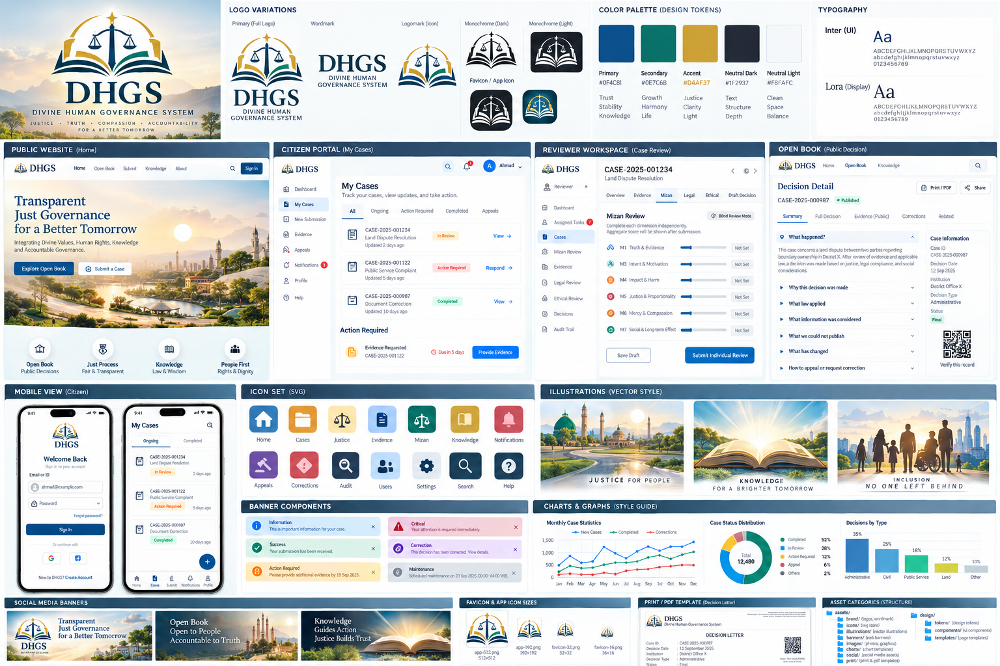

# DHGS — Divine–Human Governance System

> **Digital Governance Assurance Platform** for lawful, evidence-based, accountable, reviewable, correctable, privacy-preserving, accessible, and publicly understandable governance.

**Blueprint document baseline:** `DHGS v15.1.0`  
**Blueprint status:** Controlled implementation baseline candidate  
**Software version:** see [`VERSION`](./VERSION) and root `package.json`  
**Primary architectural specification:** [`BLUEPRINT.md`](./BLUEPRINT.md)  
**Operational implementation index:** [GitHub Issue #6 — DHGS implementation roadmap and milestone control](https://github.com/bjo163/dhgs/issues/6)

> **Versioning rule:** the Blueprint document version and the software semantic version are independent version streams. A Blueprint revision does not automatically imply a software release, and a software patch/minor release does not automatically change the Blueprint version.

---

## North Star

> **No material public power without lawful authority, accountable ownership, sufficient evidence, traceable record, reviewability, and a correction path.**

DHGS is governance-assurance infrastructure. It is not a replacement for a constitution, court, legislature, executive government, religion, or accountable human judgment.

Its operating loop is:

```text
RECEIVE
→ KNOW
→ VERIFY
→ ASSIGN
→ ASSESS
→ DECIDE
→ RECORD
→ EXECUTE
→ EXPLAIN
→ MONITOR
→ REVIEW
→ CORRECT
→ LEARN
```

---

## Core concepts

- **Shadow** — independent supervisory, mediation, and accountability function. Shadow supervises power; Shadow does not own power.
- **Mizan** — non-adjudicative decision-readiness and balancing engine. It does not determine legal guilt or human worth.
- **Hisab Ledger** — append-oriented accountability history for material uses of public power.
- **Open Book** — privacy-safe public communication and transparency layer.
- **Corpus** — curated, versioned, reusable knowledge separated from case-specific evidence.
- **Authority Mandate Registry** — machine-readable record of who may lawfully do what, where, when, and under which legal source.
- **Decision Context Snapshot** — preserves the law, policy, rule, corpus, engine, schema, and reviewer versions used for a high-impact decision.
- **Product Experience Plane** — information architecture, journeys, interaction safety, accessibility, content design, and usability.
- **Visual / Asset Governance** — logos, icons, SVG/vector assets, diagrams, charts, banners, images, print/PDF assets, provenance, licensing, and synthetic-media disclosure.
- **DHGS ORM / Model Layer** — a small Odoo-inspired, governance-aware model framework for typed models, manifests, repositories, metadata-driven views, access context, audit hooks, and ledger integration.
- **Correction** — detect → acknowledge → correct → record → learn.

A central design rule is:

> **Design must clarify power, not glorify it.**

---

## Current implementation status

DHGS remains a **controlled implementation candidate**, not a completed governance system.

Current software milestone:

# **M0 — FOUNDATION KERNEL — ACTIVE**

Current primary implementation target:

# **Issue #1 — stabilize `@dhgs/orm` kernel first**

Supporting repository/release/documentation work may progress in parallel only where it does not destabilize the primary foundation path.

The milestone exit chain is:

```text
#5   M0 FOUNDATION PASS
 ↓
#19  M1 CASE / IDENTITY / KNOWLEDGE PASS
 ↓
#30  M2 DECISION PASS
 ↓
#42  M3 EXECUTION / ACCOUNTABILITY / PUBLIC PASS
 ↓
#60  M4 ASSURANCE / HARDENING PASS
 ↓
#75  M5 CONTROLLED PILOT GO | CORRECT | NO_GO
 ↓
controlled operation + evidence
 ↓
#76  CONTINUE | CORRECT | RESET
```

The complete operational backlog lives in **master issue #6**. GitHub issue numbers are operational work-item references; stable architecture/traceability IDs remain the `REQ-*`, `CTRL-*`, `RULE-*`, `INV-*`, `TEST-*`, and `KPI-*` identifiers defined by the Blueprint and machine registries.

---

## Repository and delivery model

Long-lived branches under the current architecture:

```text
dev
main
```

Delivery contract:

```text
dev
  ↓ Pull Request only
main
  ↓ semantic version planning
VERSION + package.json
  ↓
CHANGELOG.md
  ↓
vX.Y.Z tag
  ↓
GitHub Release
  ↓
controlled deployment
```

Rules:

- `dev` is the active integration/development branch.
- `main` is the controlled release branch.
- Persistent `feature/*`, `release/*`, and `hotfix/*` branches are not part of the current architecture.
- Pull requests to `main` must originate from `dev`.
- Conventional PR/commit release semantics are used after the baseline software release exists.
- The first no-tag release must publish the current software baseline version exactly once rather than inferring a spurious bump from bootstrap history.
- Release automation owns software version/changelog/tag/release metadata; normal feature PRs should not manually edit `CHANGELOG.md`.

### Current branch-protection limitation

Actions-based branch/PR guards are present, but **server-side GitHub Rulesets are not yet considered active/verified**. This is tracked by **Issue #77** and remains an M0 blocker.

Until #77 is completed and verified, repository automation is defense-in-depth rather than a substitute for GitHub server-side branch protection.

---

## Repository layout

```text
dhgs/
├── README.md
├── BLUEPRINT.md
├── VERSION
├── CHANGELOG.md
├── design/
├── assets/
│   ├── brand/
│   ├── icons/
│   ├── diagrams/
│   ├── banners/
│   ├── charts/
│   ├── social/
│   └── images/
├── apps/
│   ├── public-web/
│   ├── ops-web/
│   └── api/
├── packages/
│   ├── ui/
│   ├── data/              # current prototype/spike; migrate or formally deprecate in M0
│   ├── orm/               # M0 kernel target
│   └── orm-base/          # M0 base addon target
├── engines/
│   ├── evidence-engine/
│   ├── mizan-engine/
│   ├── policy-engine/
│   ├── ledger-engine/
│   └── publication-engine/
└── corpus/
    ├── governance/
    ├── ethical/
    ├── scriptural/
    └── lessons/
```

The Blueprint describes additional required modules and engines. Their absence in the current prototype does not remove the requirement; implementation must be mapped through the issue-led program and milestone gates.

---

## Visual exploration

The following board is a **non-canonical visual exploration**. It helps communicate the direction of the brand and interface language, but it is not itself a logo specification, legal seal, or approved final UI.



Canonical visual identity work is tracked separately and remains governed by the asset manifest and design documentation. The exploratory styleboard must remain visibly non-canonical until the relevant visual-identity acceptance gate is complete.

---

## Product surfaces

### Public Web

Prototype for:

```text
OPEN BOOK
PUBLIC EXPLANATION
CITIZEN PORTAL
APPEAL / CORRECTION DISCOVERABILITY
PUBLIC KNOWLEDGE
```

### Operations Web

Prototype for:

```text
REVIEWER DASHBOARD
MIZAN REVIEW
AUDIT TIMELINE
DECISION CONTEXT VISIBILITY
```

### API

The initial Fastify API exposes only basic technical health/meta endpoints. It explicitly identifies the prototype as `SANDBOX` and has no statutory/coercive authority.

---

## Visual identity and assets

The exploratory asset direction uses a neutral **balanced horizon** concept:

```text
BOUNDARY / ACCOUNTABILITY
+
MIZAN / BALANCE
+
ACCOUNTABLE DECISION POINT
+
MOVEMENT TOWARD CLARITY
```

The visual identity must not depict Allah, a prophet, a political leader as system authority, or an invented governmental seal.

Governed asset classes include:

- primary logo/wordmark/logomark variants;
- monochrome/reverse/compact/PWA/print variants;
- domain and status icons;
- product/process diagrams;
- banners and correction/emergency notices;
- truthful accessible chart templates;
- social/Open Graph artwork;
- print/PDF assets;
- machine-readable asset manifest;
- explicitly non-canonical exploration assets.

See [`design/visual-identity.md`](./design/visual-identity.md) and [`design/asset-manifest.json`](./design/asset-manifest.json) for the current design artifacts.

---

## UX foundation

The repository contains concrete starting artifacts for:

- public and operations information architecture;
- stable screen IDs;
- low-fidelity wireframe contracts;
- high-stakes interaction patterns;
- Mizan reviewer score blinding;
- evidence status/provenance visibility;
- appeal and correction discoverability;
- role-focused dashboards;
- save/recovery and error-state principles;
- WCAG 2.2 AA target;
- content/plain-language rules;
- shared design tokens and core UI components.

See [`design/`](./design/).

---

## DHGS ORM and data-driven module architecture

DHGS uses a **small Odoo-inspired model/addon pattern**, adapted for governance rather than copied wholesale.

```text
packages/orm
    ↓ framework kernel
packages/orm-base
    ↓ foundational manifest + base models
addon/domain packages
    ↓ cases / evidence / knowledge / governance / openbook / audit
PostgreSQL / Supabase
```

### `@dhgs/orm` — framework kernel

M0 responsibilities include:

```text
FIELD DEFINITIONS
MODEL DEFINITIONS
MODEL REGISTRY
ENVIRONMENT / REQUEST CONTEXT
DOMAIN / FILTER AST
REPOSITORY / MODEL METHODS
MANIFEST / ADDON LOADING
VIEW METADATA
ACTION / COMMAND REGISTRY
ADAPTER CONTRACT
AUDIT / LEDGER HOOKS
```

Target ergonomic API:

```ts
const env = dhgsEnv(context)
const Cases = env.model('case.case')

const rows = await Cases.search([
  ['status', '=', 'submitted'],
  ['jurisdiction_id', '=', context.jurisdictionId]
])

const record = await Cases.create(values)
await record.write({ title: 'Corrected title' })
await record.archive()
```

There is **no unrestricted hard-delete API** for governance records.

### `@dhgs/orm-base` — foundational addon

The base addon should contain only reusable platform models, not Mizan/decision business logic.

Initial model candidates:

```text
base.jurisdiction
base.institution
base.party
base.user_profile
base.access_group
base.group_membership
base.authority_mandate
base.delegation
base.sequence
base.attachment
base.tag
base.tag_link
base.activity
base.notification
base.translation
base.external_id
base.audit_reference
```

Domain-specific models belong in domain addons, for example:

```text
case.*
evidence.*
knowledge.*
governance.*
ledger.*
openbook.*
audit.*
```

### Manifest pattern

Each addon/package should expose one manifest:

```ts
export const manifest = defineAddon({
  name: 'case',
  version: '0.1.0',
  depends: ['base'],
  models: [...],
  data: [...],
  views: [...],
  menus: [...],
  actions: [...],
  access: [...],
  upgrades: {...}
})
```

Manifest metadata is the canonical module boundary. Dependencies must be explicit and cycle-free.

### Data-driven views

Model metadata may generate safe list/form/search administration screens:

```text
MODEL
+
FIELD METADATA
+
VIEW METADATA
+
ACCESS CONTEXT
→
GENERIC LOW-RISK UI
```

This must **not** turn high-stakes governance into generic CRUD.

Explicit screens/workflows remain mandatory for:

```text
MIZAN
LEGAL / RIGHTS REVIEW
DECISION AUTHORIZATION
DECISION EXECUTION WHERE HIGH-IMPACT
APPEAL
CORRECTION
EMERGENCY POWER
HIGH-IMPACT PUBLICATION
```

### Governance-aware context

Every material model operation should be capable of carrying:

```text
actor_id
request_id
purpose
identity_assurance
jurisdiction
institution
roles / permissions
transaction
```

PostgreSQL RLS remains authoritative for row access; application/ORM authorization adds defense-in-depth and does not replace RLS.

The existing `packages/data` package is a **prototype of this direction**. It must be migrated/refactored or formally deprecated through M0 rather than expanded ad hoc.

---

## Simple-first technical direction

DHGS deliberately avoids premature infrastructure complexity.

- **TypeScript**
- **Next.js + React** — Public Web and Operations Web
- **Node.js + Fastify** — API
- **Pure TypeScript packages** — governance engines and ORM kernel
- **Supabase PostgreSQL / Auth / Storage** — intended transactional identity/data layer
- **PostgreSQL RLS** — authoritative row-access boundary on exposed data
- **PostgreSQL-backed jobs/outbox first** — intended asynchronous-work foundation before introducing specialized infrastructure
- **Vitest** — unit / rule / ORM tests
- **Playwright** — planned E2E/accessibility journey tests
- **GitHub Actions** — CI, policy, security, release, and roadmap automation
- **Vercel + Supabase** — intended initial hosted environments

Not required for the MVP: Kubernetes, Kafka, blockchain, Temporal, OPA, OpenFGA, vector databases, native mobile apps, or autonomous AI agents.

> **Complexity must be earned.**

---

## Engine boundary

Engine packages remain advisory or narrowly authoritative only within their explicit software responsibility:

```text
Evidence Engine
→ evidence quality / uncertainty / gaps

Mizan Engine
→ decision readiness only
→ never legal guilt

Policy / Guard Engine
→ explicit testable guard actions

Rights Impact Engine
→ rights impact / remedy assessment

Knowledge Retrieval Engine
→ relevant versioned contextual knowledge
→ never a universal truth score

Ledger Engine
→ append/correction accountability history

Publication / Redaction Engine
→ P0/P1 privacy-safe public projection

Metrics Engine
→ versioned governance KPI / health calculations
→ never human-worth scoring
```

The corpus remains separate from case evidence. Scriptural/ethical references remain reference material and do not automatically create coercive authority.

---

## Issue-led implementation discipline

Non-trivial implementation is **issue-first**.

```text
BLUEPRINT CAPABILITY
→ REQ / CTRL / RULE / INV / KPI where critical
→ MILESTONE
→ GITHUB ISSUE
→ IMPLEMENTATION
→ TEST
→ CI / SECURITY EVIDENCE
→ ACCEPTANCE
→ CLOSE
```

Rules:

1. **Only one implementation milestone should be active at a time.**
2. Non-trivial implementation must have an issue before code is expanded.
3. Every implementation issue should state objective, scope/non-scope, dependencies, acceptance criteria, required tests, and Definition of Done.
4. A new idea that does not belong to the active milestone goes to the master backlog; it does not interrupt current work.
5. Scope growth during implementation requires updating the issue or creating a follow-up issue.
6. A closed issue must satisfy its acceptance criteria; “code exists” is not enough.
7. Critical behavior must have tests/evidence before its milestone can exit.
8. Foundational architecture changes require Blueprint/ADR reconciliation before implementation continues.
9. GitHub issue numbers are operational references, not substitutes for stable requirement/control/rule/invariant IDs.

### Milestone sequence

```text
M0 — FOUNDATION KERNEL
     ORM / ORM-BASE / DB-RLS / schemas-events / async-outbox
     UI contracts / repository automation / rulesets / reproducible dependencies

M1 — CASE, IDENTITY, KNOWLEDGE & INTAKE SPINE
     authentication / authorization / mandate / case / work / notice
     privacy-noticed intake / secure evidence / corpus / knowledge retrieval

M2 — DECISION SPINE
     legal precheck / rights / evidence engine / Mizan / policy guard
     legal-ethical review / conflict / human decision / context snapshot

M3 — EXECUTION, ACCOUNTABILITY & PUBLIC
     decision execution / remedy verification / Hisab / Audit / publication
     Open Book / budget-resource context / appeal / correction / public interfaces

M4 — ASSURANCE & HARDENING
     security / privacy / resilience / accessibility / independent oversight
     risk-control assurance / metrics / anti-capture / simulation / calibration

M5 — DEPLOYMENT, GOVERNANCE-OF-SOFTWARE & CONTROLLED PILOT
     separated environments / migrations / controlled production release
     external boundaries / operating modes / optional AI/signature controls
     pilot gate / year-one evidence package
```

Only **M0** is active now. Later milestones remain planned and intentionally blocked until the previous milestone exit gate closes with evidence.

For the authoritative operational checklist and current issue ordering, use **GitHub Issue #6** rather than duplicating every work-item checklist here.

---

## Software versioning and releases

The software release source is the root `VERSION` file plus the matching root `package.json` version.

Expected release behavior:

```text
NO EXISTING v* TAG
→ publish current baseline software version once

fix: / perf: / revert:
→ PATCH

feat:
→ MINOR

BREAKING CHANGE / !
→ MAJOR

non-release-only changes
→ no meaningless automatic bump
```

Automation is expected to keep these aligned for a release:

```text
VERSION
root package.json version
CHANGELOG heading
vX.Y.Z tag
GitHub Release version
```

Dependency/toolchain reproducibility is an explicit M0 requirement. Until the canonical lockfile/toolchain baseline is complete, CI passing does not by itself prove a fully reproducible dependency graph.

---

## Run the prototype locally

Prerequisite: use the repository-supported Node.js and pnpm toolchain. M0 issue #95 owns the final pinned toolchain and frozen-lockfile baseline.

Current bootstrap commands:

```bash
pnpm install
pnpm dev:public   # http://localhost:3000
pnpm dev:ops      # http://localhost:3001
pnpm dev:api      # http://localhost:4000
```

Run available checks:

```bash
pnpm typecheck
pnpm test
pnpm build
```

This is still a **sandbox prototype**. Do not use it for real coercive or high-impact decisions.

---

## Ethical and spiritual boundary

DHGS may use scriptural and prophetic references as an **ethical reference profile**. It does not convert unverifiable spiritual claims into coercive public authority.

The design may seek compatibility with values such as truth, justice, rahmah, mercy, guidance, consultation, accountability, correction, and human dignity. It does **not** claim Divine certification, prophetic ownership, or knowledge of a future prophetic implementation.

`EXIT_TO_THE_LIGHT` remains a symbolic maturity direction, not a prophecy date, legal rule, or software feature.

---

## Canonical sources

Architectural authority:

**[`BLUEPRINT.md`](./BLUEPRINT.md)**

Operational software roadmap:

**[GitHub Issue #6 — DHGS implementation roadmap and milestone control](https://github.com/bjo163/dhgs/issues/6)**

Repository/release automation:

- Issue #44 — Actions / branch-policy / release automation.
- Issue #77 — server-side GitHub Rulesets.
- Issue #95 — pinned toolchain / lockfile / frozen installs.

Implementation progress is tracked through GitHub Issues and evidence gates rather than by continuously expanding undocumented scope inside code.
